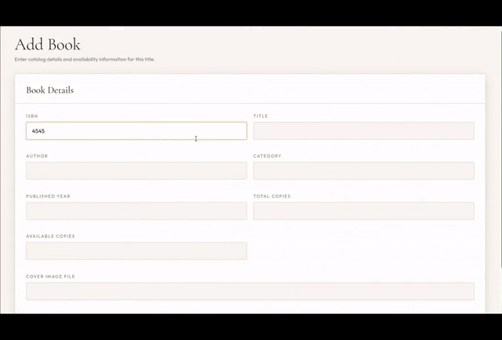

# Library Management System - CSBP461 Assignment 2

This project is a Java MVC web application for the **Library Book Management System** domain required in CSBP461: Internet Computing Assignment 2 (Spring 2026).

## Demo



> The preview plays automatically. [Download the complete four-minute demo with audio](docs/library-management-system-demo.mp4).

## Features
- Login and admin sign-up using a `users` table
- PBKDF2 password hashing for stored admin passwords
- Full CRUD for `books`
- Full CRUD for `members`
- Issue and return workflow for `loans`
- Dashboard with summary counts
- MySQL relational schema with foreign keys

## Project Structure
```text
src/main/java/com/librarymanagement
|-- controller
|-- dao
|-- model
`-- util

src/main/webapp
|-- assets/css
`-- WEB-INF/views

database
`-- G1_assignment2_databasedump.sql

docs
|-- report-outline.md
`-- sample-sql-queries.sql
```

## Technology Stack
- Java Servlets
- JSP
- JDBC
- MySQL
- HTML/CSS

## Database Setup
1. Run [G1_assignment2_databasedump.sql](database/G1_assignment2_databasedump.sql) in MySQL.
2. Update the database username/password in [DBConnectionUtil.java](src/main/java/com/librarymanagement/util/DBConnectionUtil.java) if needed.

## NetBeans + GlassFish Setup
1. Open NetBeans.
2. Choose `File` -> `Open Project`.
3. Select this repository's root folder.
4. Let NetBeans open it as a Maven web project using [pom.xml](pom.xml).
5. In NetBeans, right-click the project and set **GlassFish Server** as the run server.
6. Run [G1_assignment2_databasedump.sql](database/G1_assignment2_databasedump.sql) in MySQL.
7. Update the MySQL credentials in [DBConnectionUtil.java](src/main/java/com/librarymanagement/util/DBConnectionUtil.java).
8. If you already had the old database installed, run [admin_auth_migration.sql](database/admin_auth_migration.sql) to remove the plaintext default accounts.
9. Run [book_covers_seed.sql](database/book_covers_seed.sql) if your existing database does not already include the new cover images.
10. If GlassFish does not auto-detect the MySQL driver, add the MySQL connector JAR to GlassFish or let Maven download it through the project dependency.
11. Run the project from NetBeans.
12. Open `http://localhost:8080/library-management-system/signup`

## Compatibility Note
- This project uses `javax.servlet`, which matches classic Java EE based GlassFish setups.
- The project is now packaged as a Maven `war`, which NetBeans can import and run directly.

## Admin Login
- Open `http://localhost:8080/library-management-system/signup` to create the first admin account.
- Passwords are hashed before they are stored in the `users` table.
- After sign-up, use `http://localhost:8080/library-management-system/login` to sign in with the admin account.

## Book Covers
- Put uploaded cover images in `web/assets/img/covers`.
- The seeded catalog uses `book1.jpg` through `book10.jpg` in that folder.
- The dashboard displays those ten cover images side by side.

## Screenshots for the Report
- Login page
- Dashboard page
- Books CRUD screens
- Members CRUD screens
- Loans issue/return screens

## Submission Files
- Report PDF: `G[1-9] assignment2 report.pdf`
- Source code ZIP: `G[1-9] assignment2 source.zip`
- Database dump: `G[1-9] assignment2 databasedump.sql`
- Demo video: [`docs/library-management-system-demo.mp4`](docs/library-management-system-demo.mp4)
